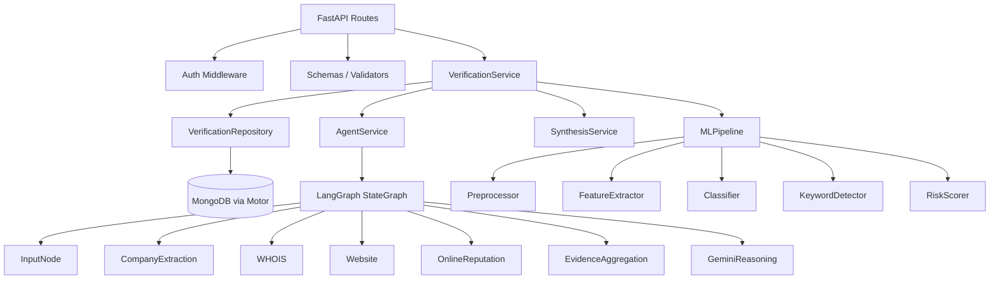

# Backend Code Analysis — Hybrid Fake Job Detection

## Architecture Overview

The backend is a **FastAPI** application that detects fraudulent job postings via a **hybrid strategy**:

| Pipeline | Tech | Role |
|----------|------|------|
| **Pipeline A (ML)** | Scikit-Learn (TF-IDF + Random Forest) | Text-based fraud classification |
| **Pipeline B (Agent)** | LangGraph + Gemini | Multi-source investigative analysis |
| **Synthesis** | Custom weighted combiner | Merges both pipelines into a final verdict |

---

## Layer Map (22 modules)



---

## Key Components Studied

### 1. Entry Point — [`main.py`](file:///d:/VS_CODE/Job-verify/backend/main.py)
- FastAPI app with **lifespan** context manager (startup/shutdown)
- Startup: configure logging → validate env vars → init Firebase → connect MongoDB
- Shutdown: close MongoDB
- Routes mounted at `/api/v1/{auth,verify,history}`
- Custom OpenAPI schema with Bearer auth security scheme

### 2. Configuration — [`settings.py`](file:///d:/VS_CODE/Job-verify/backend/app/config/settings.py)
- `pydantic-settings` based with `.env` loading
- Validates 6 required env vars at startup (MongoDB, Gemini, Tavily, Firebase)
- ML model paths configurable: `tfidf_vectorizer.pkl`, `classifier.pkl`
- Multi-origin CORS support via comma-separated `FRONTEND_URLS`

### 3. Authentication — [`firebase_auth.py`](file:///d:/VS_CODE/Job-verify/backend/app/auth/firebase_auth.py) + [`dependencies.py`](file:///d:/VS_CODE/Job-verify/backend/app/auth/dependencies.py)
- Firebase Admin SDK for JWT verification
- `get_current_user` FastAPI dependency with proper 401 responses
- `auto_error=False` on HTTPBearer for custom error formatting

### 4. API Routes
| Route | Method | Auth | Handler |
|-------|--------|------|---------|
| [`/api/v1/auth/verify`](file:///d:/VS_CODE/Job-verify/backend/app/api/routes/auth.py#L16) | POST | ✅ | Verify token, return user profile |
| [`/api/v1/auth/profile`](file:///d:/VS_CODE/Job-verify/backend/app/api/routes/auth.py#L34) | GET | ✅ | Get user profile |
| [`/api/v1/verify/`](file:///d:/VS_CODE/Job-verify/backend/app/api/routes/verify.py#L17) | POST | ✅ | Submit job for verification |
| [`/api/v1/history/`](file:///d:/VS_CODE/Job-verify/backend/app/api/routes/history.py#L17) | GET | ✅ | Paginated history |
| [`/api/v1/history/{id}`](file:///d:/VS_CODE/Job-verify/backend/app/api/routes/history.py#L45) | GET | ✅ | Single verification detail |
| `/api/health` | GET | ❌ | Health check |

### 5. ML Pipeline (Pipeline A) — [`app/ml/`](file:///d:/VS_CODE/Job-verify/backend/app/ml/pipeline.py)

| Component | File | Status |
|-----------|------|--------|
| [TextPreprocessor](file:///d:/VS_CODE/Job-verify/backend/app/ml/preprocessor.py) | `preprocessor.py` | ✅ Implemented (lowercase, HTML strip, stopwords, stemming) |
| [FeatureExtractor](file:///d:/VS_CODE/Job-verify/backend/app/ml/feature_extractor.py) | `feature_extractor.py` | ⚠️ Loads from `.pkl` or creates unfitted vectorizer |
| [JobClassifier](file:///d:/VS_CODE/Job-verify/backend/app/ml/classifier.py) | `classifier.py` | ⚠️ Loads from `.pkl` or creates untrained RF model |
| [KeywordDetector](file:///d:/VS_CODE/Job-verify/backend/app/ml/keyword_detector.py) | `keyword_detector.py` | ✅ Rule-based (6 categories, 50+ keywords) |
| [RiskScorer](file:///d:/VS_CODE/Job-verify/backend/app/ml/risk_scorer.py) | `risk_scorer.py` | ✅ Weighted combo (70% classifier, 30% keywords) |

> [!IMPORTANT]
> **The ML pipeline currently operates in "fallback" mode.** There are no trained `.pkl` model files. The pipeline gracefully degrades to keyword-only analysis (`fraud_probability=0.5`, `confidence=0.5`, `model_status="fallback"`). A training pipeline is needed to fit models on a dataset.

**Current ML architecture:**
- **Preprocessing**: Lowercase → strip HTML/URLs → remove special chars → remove stopwords → Porter stemming
- **Features**: TF-IDF (max 5000 features, uni+bigrams, 85% max DF, min 2 DF)
- **Classifier**: Random Forest (100 estimators, max depth 20, state 42)
- **Risk scoring**: `0.7 × classifier_prob + 0.3 × keyword_risk`
- **Thresholds**: Low < 0.3, Medium < 0.6, High < 0.8, Critical ≥ 0.8

### 6. Agent Pipeline (Pipeline B) — [`app/agents/`](file:///d:/VS_CODE/Job-verify/backend/app/agents/graph.py)

**LangGraph StateGraph flow:**
```
Input → CompanyExtraction → [WHOIS ∥ Website ∥ OnlineReputation] → EvidenceAggregation → GeminiReasoning
```

| Node | Purpose | External API |
|------|---------|-------------|
| [InputNode](file:///d:/VS_CODE/Job-verify/backend/app/agents/input_node.py) | URL sanitization, state init | — |
| [CompanyExtraction](file:///d:/VS_CODE/Job-verify/backend/app/agents/company_extraction_node.py) | LLM-based name/domain extraction | Gemini |
| [WHOIS](file:///d:/VS_CODE/Job-verify/backend/app/agents/whois_investigation_node.py) | Domain age, registrar check | python-whois |
| [Website](file:///d:/VS_CODE/Job-verify/backend/app/agents/website_investigation_node.py) | Career page detection, ATS check | httpx + selectolax |
| [OnlineReputation](file:///d:/VS_CODE/Job-verify/backend/app/agents/online_reputation_investigation_node.py) | Web reputation via search + LLM | Tavily + Gemini |
| [EvidenceAggregation](file:///d:/VS_CODE/Job-verify/backend/app/agents/evidence_aggregation_node.py) | Combine all evidence | — |
| [GeminiReasoning](file:///d:/VS_CODE/Job-verify/backend/app/agents/gemini_reasoning_node.py) | Final fraud assessment | Gemini |

**LLM setup:** Primary `gemini-3.6-flash` with fallbacks to `3.5-flash-lite` and `3.5-flash` via LangChain's `with_fallbacks()`.

### 7. Synthesis — [`synthesis_service.py`](file:///d:/VS_CODE/Job-verify/backend/app/services/synthesis_service.py)
- **Weights**: ML 40% + Agent 60%
- **Verdict thresholds**: `≤0.3 → legitimate`, `0.3–0.65 → suspicious`, `≥0.65 → fraudulent`
- Generates human-readable reasons and actionable recommendations

### 8. Data Layer
- **MongoDB** via Motor (async driver) — [`connection.py`](file:///d:/VS_CODE/Job-verify/backend/app/database/connection.py)
- **Repository pattern** — [`verification_repository.py`](file:///d:/VS_CODE/Job-verify/backend/app/repositories/verification_repository.py)
- **Document model** — [`VerificationDocument`](file:///d:/VS_CODE/Job-verify/backend/app/models/verification.py) with compound index on `(firebase_uid, timestamp)`
- Data scoped per user via Firebase UID

### 9. DI Container — [`container.py`](file:///d:/VS_CODE/Job-verify/backend/app/dependencies/container.py)
- Lazy singleton pattern for all services
- Wires: `MLPipeline → VerificationService ← AgentService, SynthesisService, Repository`

### 10. Cross-Cutting Concerns
- **Logging**: Loguru with stdout + file rotation (10MB, 30 day retention, errors 90 days)
- **Error handling**: Global exception handlers mapping `ApplicationError` subtypes to proper HTTP codes
- **CORS**: Dev mode allows localhost:5173/3000; prod reads from `FRONTEND_URLS`

---

## What's Missing for the ML Pipeline

> [!CAUTION]
> The ML pipeline has all the **inference scaffolding** in place but **no training pipeline**. The system currently runs in keyword-only fallback mode.

To make Pipeline A functional, we need:

1. **Training dataset** — A labeled dataset of job postings (e.g., Kaggle's "Real or Fake Job Postings" dataset with `fraudulent` column)
2. **Training script** — A script that:
   - Loads and preprocesses the dataset
   - Fits the TF-IDF vectorizer on training data
   - Trains the Random Forest classifier
   - Evaluates metrics (accuracy, precision, recall, F1)
   - Saves fitted `tfidf_vectorizer.pkl` and `classifier.pkl` to `app/ml/models/`
3. **Model evaluation** — Validation metrics and possibly cross-validation
4. **Optional enhancements** — Class balancing (SMOTE), hyperparameter tuning, feature engineering

The existing classes ([`FeatureExtractor.save_vectorizer()`](file:///d:/VS_CODE/Job-verify/backend/app/ml/feature_extractor.py#L75), [`JobClassifier.train()`](file:///d:/VS_CODE/Job-verify/backend/app/ml/classifier.py#L101), [`JobClassifier.save_model()`](file:///d:/VS_CODE/Job-verify/backend/app/ml/classifier.py#L148)) already have `train()` and `save()` methods — they just need to be orchestrated.

---

## Summary

✅ **Fully implemented and working**: Auth, routes, schemas, database, DI container, logging, error handling, CORS, agent pipeline (all 7 nodes), synthesis service, LLM fallback chain, keyword detection

⚠️ **Needs work**: ML model training pipeline (no `.pkl` files exist — fallback mode active)

Ready to work on the ML pipeline whenever you are.
